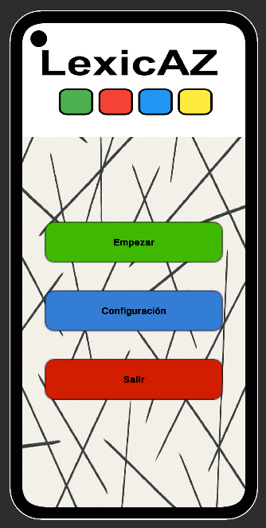
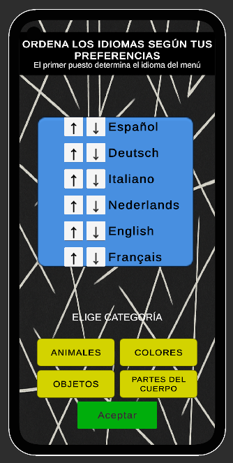
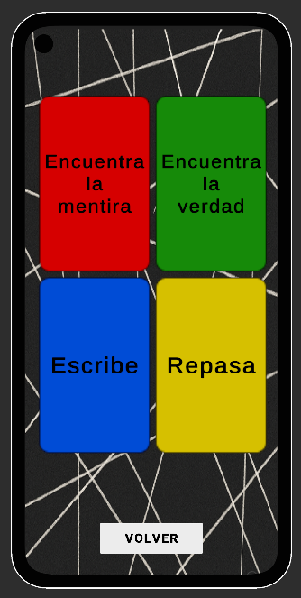
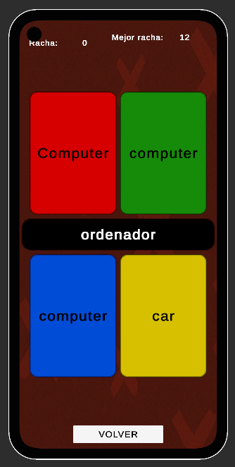
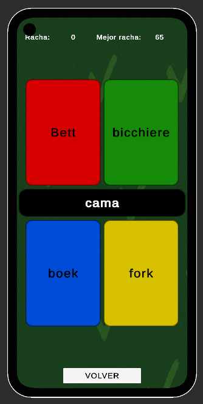
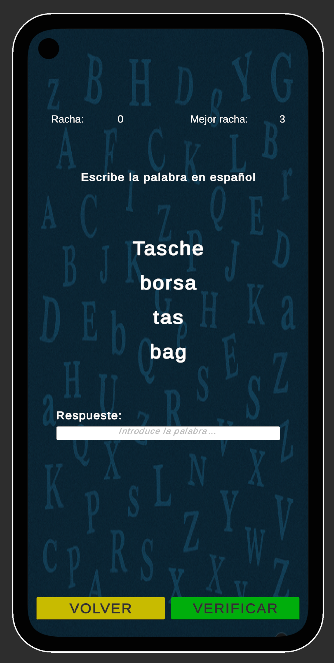
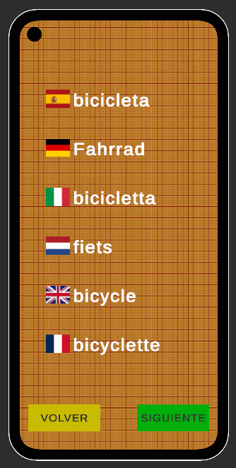

# 📱 LexicAZ

Mobile app to learn vocabulary across multiple languages through interactive minigames.

## 📦 Download APK (Android)

👉 https://github.com/vitoarez/LexicAZ/releases/tag/v1.0

---

## 🎯 About the project

LexicAZ is a mobile application developed in Unity aimed at helping users learn vocabulary in multiple languages simultaneously through interactive minigames.

This project was developed as the final project of my Multiplatform Application Development (DAM) degree.

---

## 🚀 Features

- Vocabulary learning across multiple languages
- Language order customization
- Category selection (animals, colors, objects…)
- Multiple minigames:
  - Find the incorrect translation
  - Find the correct translation
  - Write the word
  - Review mode
- Local SQLite database (offline support)
- Responsive UI for different mobile devices

---

## 🛠️ Tech Stack

- Unity (C#)
- SQLite
- Android
- Git & GitHub
- Visual Studio Code
- Ubuntu Linux

---

## ▶️ How to run the app

1. Download the APK from the link above
2. Install it on an Android device
3. Allow installation from unknown sources if required

> Academic project – not published on Google Play (yet)

---

## 📁 Project structure

- `Assets/` – Source code, scenes and resources  
- `Packages/` – Project dependencies  
- `ProjectSettings/` – Unity configuration  

Unity-generated folders (Library, Temp…) are excluded via `.gitignore`.

---

## 📚 What I learned

- Mobile app development with Unity
- C# programming
- SQLite database integration
- Responsive UI design
- Version control with Git
- Structuring a real-world project

---

## 📸 Screenshots

<table>
  <tr>
    <td align="center"><b>Main Menu</b></td>
    <td align="center"><b>Settings</b></td>
    <td align="center"><b>Game Modes</b></td>
    <td></td>
  </tr>
  <tr>
    <td></td>
    <td></td>
    <td></td>
    <td></td>
  </tr>
  <tr>
    <td align="center"><b>Find Incorrect</b></td>
    <td align="center"><b>Find Correct</b></td>
    <td align="center"><b>Write Word</b></td>
    <td align="center"><b>Review</b></td>
  </tr>
  <tr>
    <td></td>
    <td></td>
    <td></td>
    <td></td>
  </tr>
</table>

---

## 👨‍💻 Author

**Víctor Arroyo**  
Junior Multiplatform Application Developer (DAM)

📧 arroyoiba@gmail.com  
🔗 https://github.com/vitoarez
